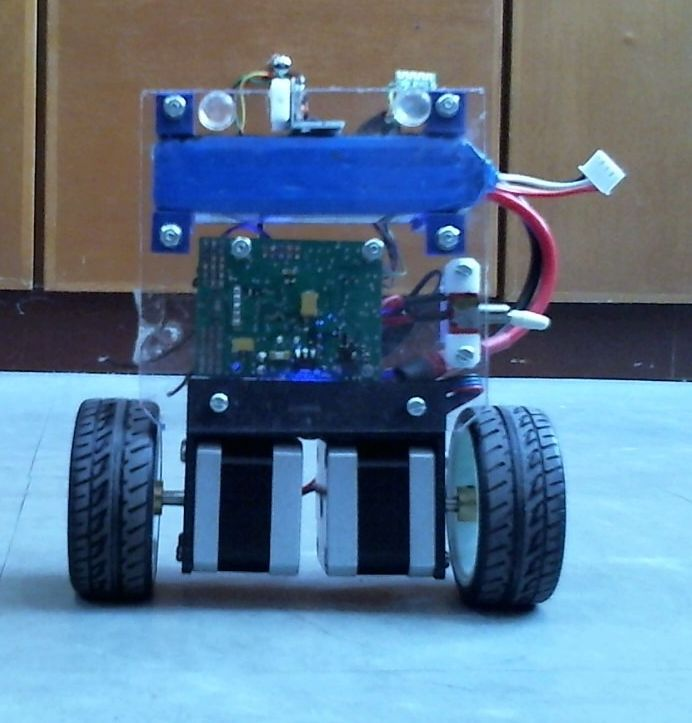

# Two_Wheels_Robot_V0_90S_OS

Design documents and codes for Two-wheels self-balancing robot using stepper motors as described in [Modeling and Control of Two-Wheels Self Balancing (TWSB) Robot](https://fkeng.blogspot.com/2019/03/theory-and-design-of-two-wheels-self.html).  Basic design with dsPIC33EP256MU806 micro-controller board. Version 0.90S_OS.  See the PDF file for design details such as schematic, photos.
Firmware is build using MPLAB-X IDE Version 5.10 or later, with MPLAB XC16 C-Compiler (Free Version), Version 1.41 or later. PDF file contains basic compilation guide. 
You can connect the robot to a computer or smartphone using USB-to-serial converter cable or HC-05 Bluetooth module. The serial communication settings needs to be reconfigured to baud rate = 115200 bps, 8-bits data, 1 start bit, 1 stop bit, no parity bit, no hand-shaking.
Any serial terminal program, such as Arduino IDE Serial Monitor, putty etc can be used. Once connected, the robot will sends its current tilt angle in string
format every 20 msec to the computer or smartphone.
You can also control the robot by sending the following characters:
* 'l' = Turn left a bit.
* 'r' = Turn right a bit.
* 'f' = Move forward
* 't' = Move backward
* 'x' = Stop moving.
